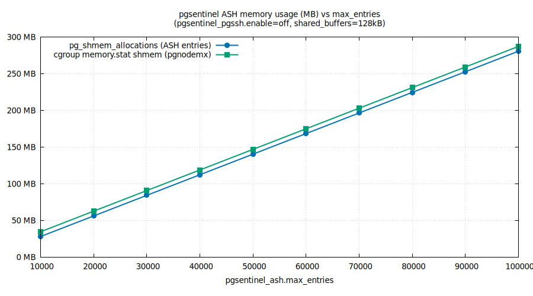
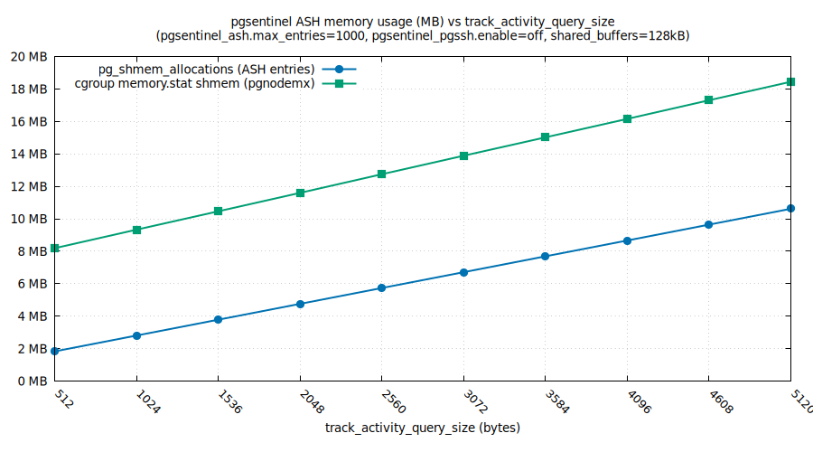

# pgsentinel ASH Memory Benchmark

Measures the shared memory footprint of [pgsentinel](https://github.com/pgsentinel/pgsentinel)'s
Active Session History (ASH) ring buffer across different `pgsentinel_ash.max_entries` and
`track_activity_query_size` values, using a local Docker container built from CNPG images.
OS-level shared memory is cross-checked via [pgnodemx](https://github.com/pgnodemx/pgnodemx)'s
`cgroup_setof_kv('memory.stat')`.

## Method

`measure-ash-shmem.sh` builds a Docker image combining:
- `ghcr.io/cloudnative-pg/postgresql:18-standard-trixie` (base)
- `ghcr.io/ardentperf/pgsentinel:1.3.1-18-trixie` (extension)
- `ghcr.io/ardentperf/pgnodemx-testing:2.0.1-202603060728-18-trixie` (extension)

For each `max_entries` value it starts a fresh postgres instance with
`pgsentinel_pgssh.enable=off` and `shared_buffers=128kB` (minimized to reduce noise),
then queries:
- `pg_shmem_allocations` — postgres-reported size of ASH shared memory segments (filtered to rows where `name LIKE 'Ash%'`)
- `cgroup_setof_kv('memory.stat')` — OS-reported container shared memory via pgnodemx (filtered to `key = 'shmem'`)


## Results

### Experiment 1: varying max_entries (track_activity_query_size=1024, default)



Both `pg_shmem_allocations` and `cgroup memory.stat shmem` grow linearly at the
same rate. The ~7 MB gap between the two lines is the rest of PostgreSQL's baseline
shared memory at `shared_buffers=128kB`.

**Measured cost: 2,944 bytes per ASH entry** at default `track_activity_query_size=1024`, comprised of (see [`ashEntry` struct](https://github.com/pgsentinel/pgsentinel/blob/2784fd15a3babf30f859adfaf22ecf1922254a8e/src/pgsentinel.c#L226)):
- `sizeof(ashEntry)` struct
- 12 × `NAMEDATALEN` (64 bytes each) — username, datname, appname, client addr/hostname, wait event type/name, state, cmdtype, backend type, blocker state, top-level query type
- 2 × `track_activity_query_size` (1,024 bytes default) — query and top-level query text

Query text storage alone accounts for **70% of the per-entry cost** (2,048 of 2,944 bytes).

### Experiment 2: varying track_activity_query_size (max_entries=1000)



Each additional 512 bytes of `track_activity_query_size` adds 1,024 bytes/entry (stored twice).
The general formula for bytes per entry is:

```
bytes/entry = 2944 - 2*1024 + 2*track_activity_query_size
            = 896 + 2 * track_activity_query_size
```

## Sizing for 2-Minute Incident Retention

Evaluating this extension for a system where data is pulled out to an external data store every 
minute. Unfortunately, the data in the ASH is most useful at the times when it's also most
likely to be lost. During actual incidents, all connections can be active and the ring buffer 
can easily wrap around such that data is overwritten before we're able to get it out. A very 
conservative approach is to size buffer for retaining several minutes of data with all 
connections being active. It practice a smaller buffer is likely to still give us enough data 
to troubleshoot - but we will run calculations at a 2 minute sizing just as a reference point.
It's also worth noting that 10% is a lot of memory; in practice we probably want it a bit lower.

To retain 2 minutes of data (1 sample/sec) when all connections are active:

```
pgsentinel_ash.max_entries = max_connections * 120
```

### By RAM (default track_activity_query_size=1024)

The table below shows the highest `max_connections` that keeps the ASH buffer
at or under 10% of total RAM. See `max-connections-table.py` to recompute.

| RAM | 10% limit | max_entries | max_connections |
|-----|-----------|-------------|-----------------|
| 1G  | 102 MB    | 36,472      | 303             |
| 2G  | 205 MB    | 72,944      | 607             |
| 4G  | 410 MB    | 145,888     | 1,215           |
| 8G  | 819 MB    | 291,777     | 2,431           |
| 16G | 1,638 MB  | 583,555     | 4,862           |

### By track_activity_query_size (4GB RAM)

| query_size | bytes/entry | max_entries | max_connections |
|------------|-------------|-------------|-----------------|
| 512B       | 1,920       | 223,696     | 1,864           |
| 1024B      | 2,944       | 145,888     | 1,215           |
| 1536B      | 3,968       | 108,240     | 902             |
| 2048B      | 4,992       | 86,037      | 716             |
| 2560B      | 6,016       | 71,392      | 594             |
| 3072B      | 7,040       | 61,008      | 508             |
| 3584B      | 8,064       | 53,261      | 443             |
| 4096B      | 9,088       | 47,259      | 393             |
| 4608B      | 10,112      | 42,473      | 353             |
| 5120B      | 11,136      | 38,568      | 321             |

Note: all figures are ASH buffer constraint only. In practice `max_connections` also
drives other shared memory costs (PGPROC structs, lock tables, etc.).

## Prerequisites

- Docker
- gnuplot
- python3

## Usage

```bash
# Step 1: measure ASH memory vs max_entries
bash measure-ash-shmem.sh

# Step 2: measure ASH memory vs track_activity_query_size
bash measure-ash-query-size.sh

# Step 3: generate graphs from results
bash graph.sh

# Step 4: print sizing tables
python3 max-connections-table.py
```
